# CareerCompass — Architecture

> **Last updated:** July 2025 · Next.js 16 · React 19 · Tailwind v4 · Supabase · Gemini AI

CareerCompass is a four-tool AI career toolkit deployed on Vercel.
This document maps every major flow—system topology, request paths,
auth, data, component hierarchy, and deployment—so that any engineer
can orient quickly.

---

## Table of Contents

1. [High-Level System Architecture](#1-high-level-system-architecture)
2. [Request Flows — AI Tools](#2-request-flows--ai-tools)
   - [Career Map](#21-career-map)
   - [Resume Studio](#22-resume-studio)
   - [Ghost Buster](#23-ghost-buster)
   - [Career Journey](#24-career-journey)
3. [Authentication Flow](#3-authentication-flow)
4. [Quota & Rate Limiting](#4-quota--rate-limiting)
5. [JD Extraction Pipeline](#5-jd-extraction-pipeline)
6. [Component Hierarchy](#6-component-hierarchy)
7. [Data Model](#7-data-model)
8. [Deployment & Infrastructure](#8-deployment--infrastructure)

---

## 1. High-Level System Architecture

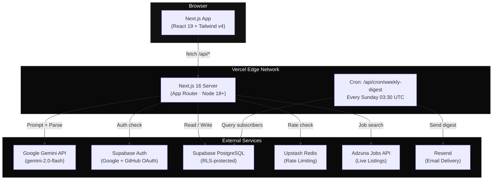

---

## 2. Request Flows — AI Tools

### 2.1 Career Map

The flagship tool: paste a resume → get matched roles, a roast/analysis,
daily pulse insights, and the ability to save skill journeys.

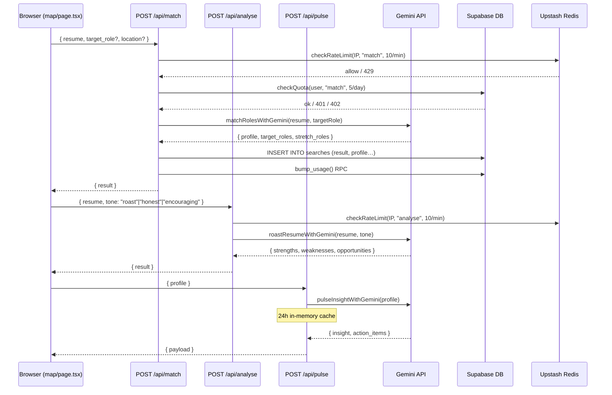

**Key files:**
| File | Role |
|------|------|
| `src/app/map/page.tsx` | Page component (~1 200 lines, custom grid) |
| `src/app/api/match/route.ts` | Role matching endpoint |
| `src/app/api/analyse/route.ts` | Resume roast / analysis |
| `src/app/api/pulse/route.ts` | Daily career insights |
| `src/lib/gemini.ts` | Gemini client + prompt helpers |
| `src/lib/prompts.ts` | System prompts for match/analyse/pulse |

---

### 2.2 Resume Studio

Three modes — **Polish**, **Tailor** (to a JD), and **Cover Letter** —
plus a DOCX export.

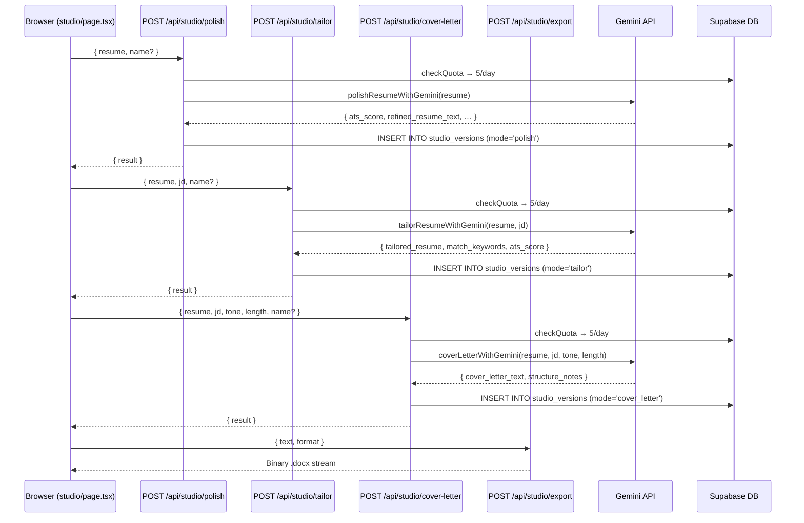

**Key files:**
| File | Role |
|------|------|
| `src/app/studio/page.tsx` | Page component (Polish / Tailor / CL tabs) |
| `src/app/api/studio/polish/route.ts` | Resume polish endpoint |
| `src/app/api/studio/tailor/route.ts` | Resume tailor endpoint |
| `src/app/api/studio/cover-letter/route.ts` | Cover letter generation |
| `src/app/api/studio/export/route.ts` | DOCX export via `docx` lib |
| `src/lib/studioPrompts.ts` | Prompts for studio tools |

---

### 2.3 Ghost Buster

Two modes: **Detect** (is this JD a ghost listing?) and **Diagnose**
(how well does my CV fit this JD?).

```mermaid
sequenceDiagram
    participant U as Browser (ghost-buster/page.tsx)
    participant API as POST /api/ghost
    participant G as Gemini API
    participant DB as Supabase DB
    participant R as Upstash Redis

    rect rgb(20,20,30)
    Note over U,API: Detect Mode
    U->>API: { mode: "detect", jd }
    API->>R: checkRateLimit(IP, "ghost", 15/min)
    API->>DB: checkQuota(user, 5/day)
    API->>G: ghostDetectWithGemini(jd)
    G-->>API: { verdict, trust_score, flags }
    API->>DB: recordUsage()
    API-->>U: { mode: "detect", result }
    end

    rect rgb(20,30,20)
    Note over U,API: Diagnose Mode
    U->>API: { mode: "diagnose", jd, cv }
    API->>R: checkRateLimit
    API->>DB: checkQuota
    API->>G: ghostDiagnoseWithGemini(jd, cv)
    G-->>API: { fit_score, rejection_reasons, fixes }
    API->>DB: recordUsage()
    API-->>U: { mode: "diagnose", result }
    end
```

**Key files:**
| File | Role |
|------|------|
| `src/app/ghost-buster/page.tsx` | Page component |
| `src/app/api/ghost/route.ts` | Detect + Diagnose endpoint |
| `src/lib/gemini.ts` | `ghostDetectWithGemini`, `ghostDiagnoseWithGemini` |

---

### 2.4 Career Journey

Track skills you're learning — log hours, set goals, and review progress.

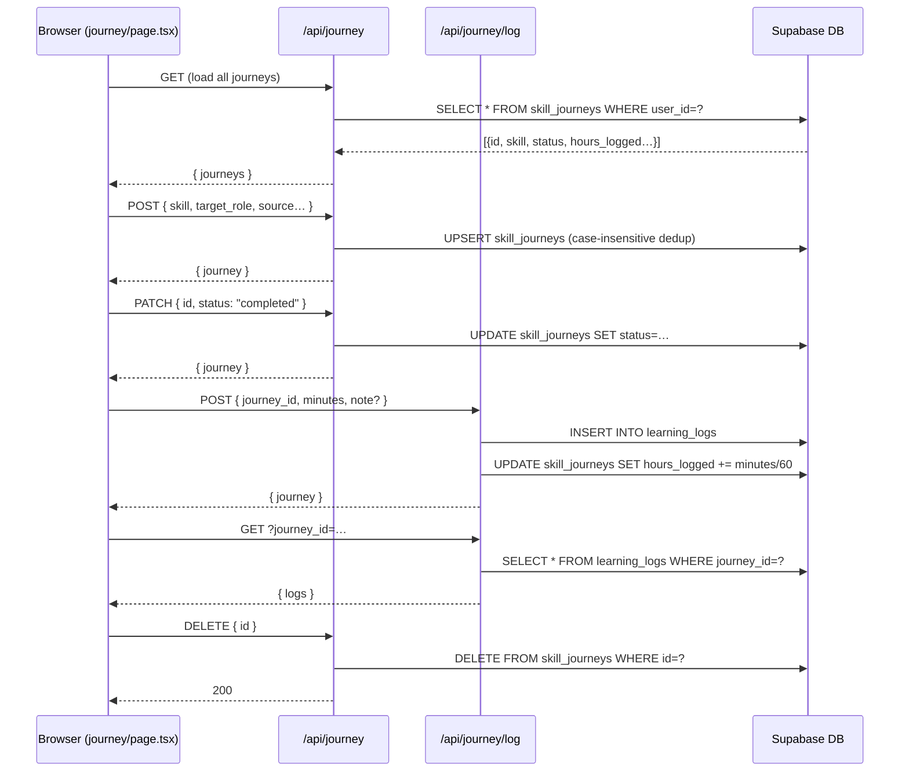

**Key files:**
| File | Role |
|------|------|
| `src/app/journey/page.tsx` | Page component |
| `src/app/api/journey/route.ts` | CRUD for skill journeys |
| `src/app/api/journey/log/route.ts` | Learning hour logging |

---

## 3. Authentication Flow

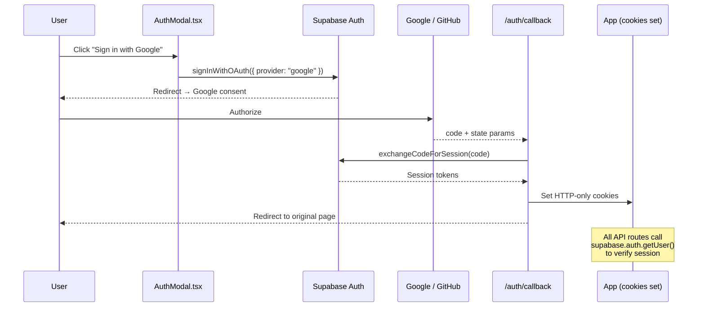

**Key files:**
| File | Role |
|------|------|
| `src/components/AuthModal.tsx` | OAuth trigger UI |
| `src/app/auth/callback/route.ts` | Token exchange + cookie set |
| `src/lib/supabase/server.ts` | `getServerSupabase()` — SSR client |
| `src/lib/supabase/browser.ts` | `getBrowserSupabase()` — client-side |

---

## 4. Quota & Rate Limiting

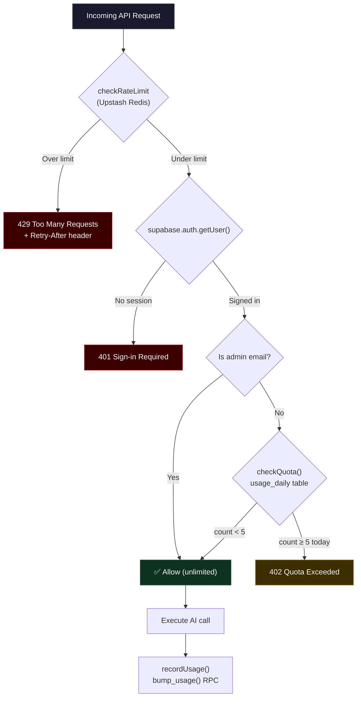

**Rate-limit buckets (per IP):**

| Bucket | Limit | Window |
|--------|-------|--------|
| `match` | 10 | 60 s |
| `ghost` | 15 | 60 s |
| `analyse` | 10 | 60 s |
| `pulse` | 30 | 60 s |
| `journey` | 60 | 60 s |
| `studio` | 10 | 60 s |
| `feedback` | 20 | 60 s |
| `jobs` | 30 | 60 s |
| `jd-fetch` | 10 | 60 s |
| `subscribe` | 10 | 60 s |

**Quota:** 5 uses / day / user (shared across all AI tools, IST bucket).

**Key files:**
| File | Role |
|------|------|
| `src/lib/usage.ts` | `checkQuota()`, `recordUsage()` |
| `src/lib/rateLimit.ts` | `checkRateLimit()` (Upstash) |

---

## 5. JD Extraction Pipeline

When a user pastes a job-posting URL, the `/api/jd/fetch` route
extracts clean text using a generic three-layer approach with no
site-specific selectors.

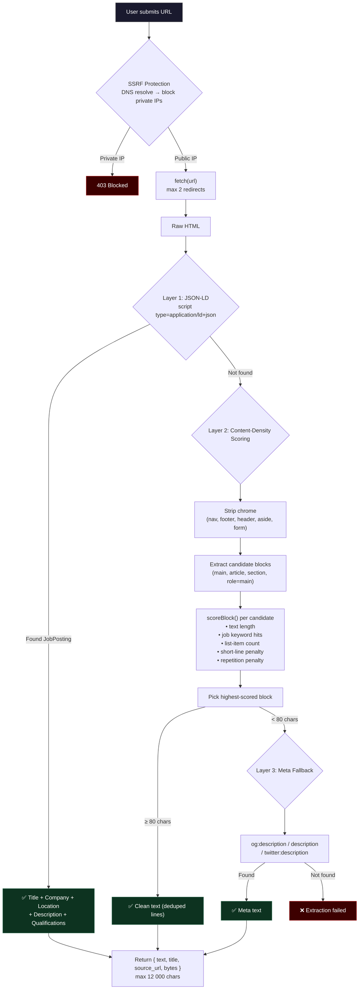

**Key file:** `src/app/api/jd/fetch/route.ts`

---

## 6. Component Hierarchy

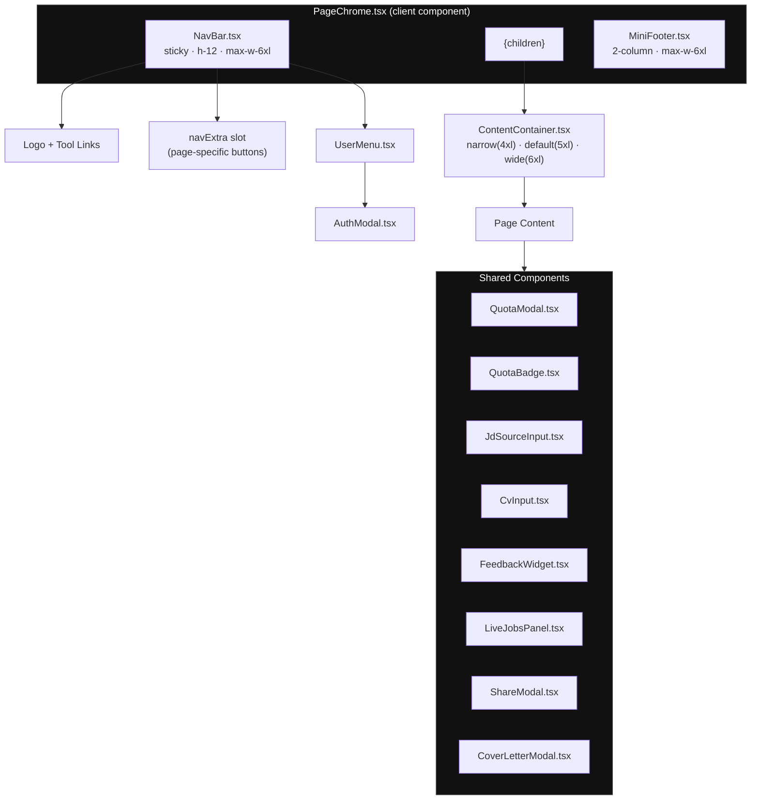

**Page → Width mapping:**

| Page | ContentContainer width | Notes |
|------|----------------------|-------|
| `/` (home) | `wide` (6xl) | Hero is full-bleed above container |
| `/map` | — (no container) | Custom grid layout, uses navExtra |
| `/studio` | `wide` (6xl) | Three-tab UI |
| `/ghost-buster` | `default` (5xl) | Detect / Diagnose tabs |
| `/journey` | `default` (5xl) | Skill cards grid |
| `/history` | `default` (5xl) | Search history list |
| `/history/[id]` | `narrow` (4xl) | Single result detail |
| `/privacy` | `narrow` (4xl) | Legal text |
| `/terms` | `narrow` (4xl) | Legal text |
| `/admin/feedback` | `default` (5xl) | Admin dashboard |
| `/admin/waitlist` | `default` (5xl) | Admin dashboard |
| `/unsubscribe` | `narrow` (4xl) | hideNav — single-purpose |
| `/s` (share) | `narrow` (4xl) | hideNav — public share view |

---

## 7. Data Model

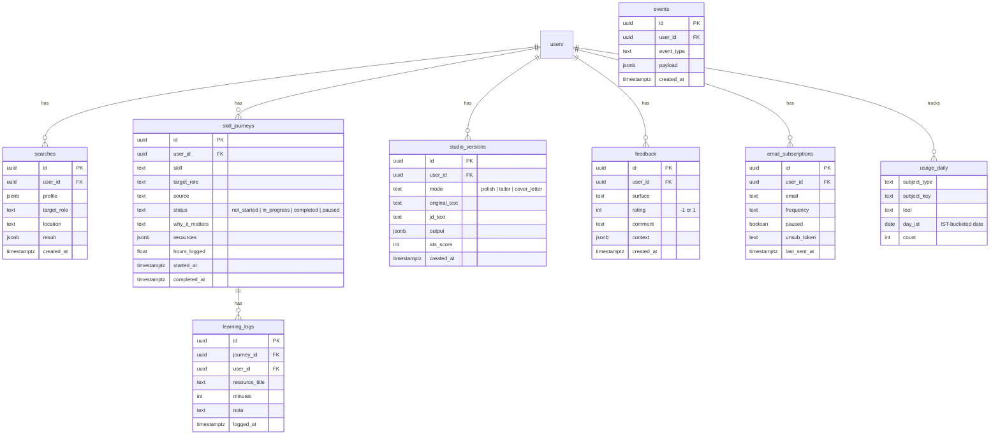

All user-owned tables enforce **Row Level Security** — each user can
only read and write their own rows.

**Key file:** `supabase/schema.sql`

---

## 8. Deployment & Infrastructure

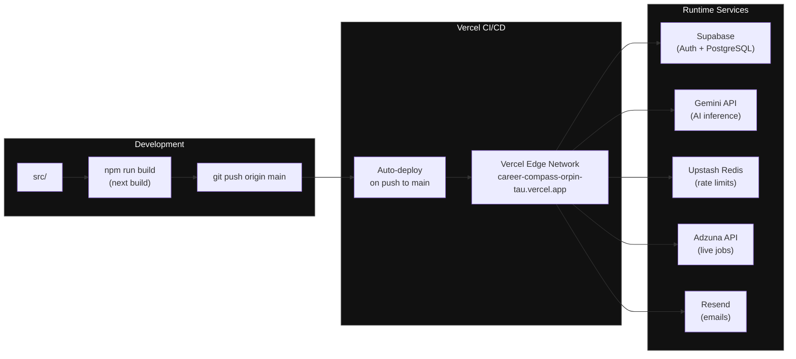

**Environment variables** (see `.env.example`):

| Variable | Required | Purpose |
|----------|----------|---------|
| `GEMINI_API_KEY` | ✅ | Google Gemini AI |
| `NEXT_PUBLIC_SUPABASE_URL` | ✅ | Supabase project URL |
| `NEXT_PUBLIC_SUPABASE_ANON_KEY` | ✅ | Supabase anon key |
| `SUPABASE_SERVICE_ROLE_KEY` | ✅ | Supabase admin key |
| `UPSTASH_REDIS_REST_URL` | Optional | Rate limiting |
| `UPSTASH_REDIS_REST_TOKEN` | Optional | Rate limiting |
| `ADZUNA_APP_ID` | Optional | Live job listings |
| `ADZUNA_APP_KEY` | Optional | Live job listings |
| `ADMIN_EMAILS` | Optional | Unlimited-quota emails |
| `RESEND_API_KEY` | Optional | Weekly digest emails |

**Cron jobs** (defined in `vercel.json`):

| Path | Schedule | Purpose |
|------|----------|---------|
| `POST /api/cron/weekly-digest` | Sun 03:30 UTC | Send weekly career digest |

---

## File Map

```
src/
├── app/
│   ├── page.tsx                       # Home (hero + feature grid)
│   ├── map/page.tsx                   # Career Map (AI matching)
│   ├── studio/page.tsx                # Resume Studio (polish/tailor/CL)
│   ├── ghost-buster/page.tsx          # Ghost Buster (detect/diagnose)
│   ├── journey/page.tsx               # Career Journey (skill tracker)
│   ├── history/
│   │   ├── page.tsx                   # Search history list
│   │   └── [id]/page.tsx             # Single result detail
│   ├── privacy/page.tsx               # Privacy policy
│   ├── terms/page.tsx                 # Terms of service
│   ├── unsubscribe/page.tsx           # Email unsubscribe
│   ├── s/page.tsx                     # Public share view
│   ├── admin/
│   │   ├── feedback/page.tsx          # Admin: user feedback
│   │   └── waitlist/page.tsx          # Admin: waitlist
│   ├── auth/callback/route.ts         # OAuth callback handler
│   └── api/
│       ├── match/route.ts             # Role matching
│       ├── analyse/route.ts           # Resume analysis / roast
│       ├── ghost/route.ts             # Ghost listing detection
│       ├── pulse/route.ts             # Daily career insights
│       ├── journey/
│       │   ├── route.ts               # Skill journey CRUD
│       │   └── log/route.ts           # Learning hour logging
│       ├── studio/
│       │   ├── polish/route.ts        # Resume polish
│       │   ├── tailor/route.ts        # Resume tailor
│       │   ├── cover-letter/route.ts  # Cover letter generation
│       │   └── export/route.ts        # DOCX export
│       ├── jd/fetch/route.ts          # JD URL extraction (3-layer)
│       ├── jobs/route.ts              # Live job listings (Adzuna)
│       ├── feedback/route.ts          # User feedback
│       ├── subscribe/route.ts         # Email subscription
│       ├── share/route.ts             # Share link generation
│       └── cron/weekly-digest/route.ts # Weekly email digest
├── components/
│   ├── PageChrome.tsx                 # Shared page wrapper (Nav + Footer)
│   ├── ContentContainer.tsx           # Width-standardized container
│   ├── NavBar.tsx                     # Sticky nav bar
│   ├── MiniFooter.tsx                 # Site footer
│   ├── UserMenu.tsx                   # Auth-aware user menu
│   ├── AuthModal.tsx                  # OAuth sign-in modal
│   ├── QuotaModal.tsx                 # Quota exceeded modal
│   ├── QuotaBadge.tsx                 # Usage counter badge
│   ├── JdSourceInput.tsx              # JD textarea + URL fetch
│   ├── CvInput.tsx                    # Resume input (paste + file upload)
│   ├── LiveJobsPanel.tsx              # Live job listings panel
│   ├── LiveStats.tsx                  # Real-time stats display
│   ├── ShareModal.tsx                 # Share career map modal
│   ├── CoverLetterModal.tsx           # Cover letter modal
│   ├── FeedbackWidget.tsx             # Thumbs up/down feedback
│   ├── ExtrasInput.tsx                # Additional CV fields
│   └── SplashBento.tsx                # Landing page hero grid
└── lib/
    ├── gemini.ts                      # Gemini client + all AI functions
    ├── prompts.ts                     # System prompts (match/analyse/pulse)
    ├── studioPrompts.ts               # Studio prompts (polish/tailor/CL)
    ├── usage.ts                       # Quota checking & recording
    ├── rateLimit.ts                   # Upstash rate limiter
    └── supabase/
        ├── server.ts                  # Server-side Supabase client
        └── browser.ts                 # Browser-side Supabase client
```

---

*Diagrams render natively on GitHub. Open this file on
github.com/siddhu-tri2000/career-compass to see interactive charts.*
